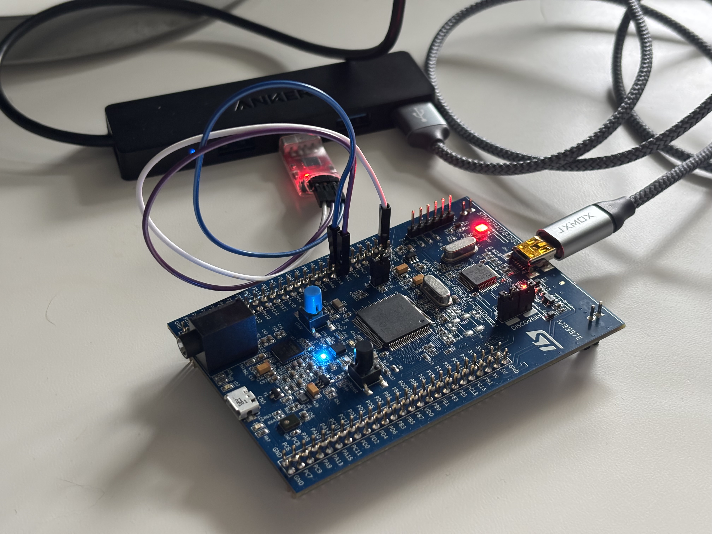

# STM32 Bare-Metal Programming from Scratch

Register-level embedded systems programming on the STM32F407 Discovery Board — no HAL, no Arduino, no CubeIDE code generation. Every peripheral is configured by reading the reference manual and writing directly to hardware registers.

## Why Bare-Metal?

Most STM32 tutorials start with HAL libraries or CubeIDE's code generator. You click a few buttons, a few thousand lines of code appear, and your LED blinks. But you don't understand *why* it blinks.

This project series takes the opposite approach. Each project configures peripherals by writing to specific memory addresses documented in ST's reference manual. When something doesn't work, you debug by reading register values and cross-referencing datasheets — the same way you'd debug a real production system where the HAL abstracts away the problem.

The result is a deep understanding of how ARM Cortex-M microcontrollers actually work: clock trees, bus architectures, GPIO multiplexing, peripheral configuration, and serial communication at the bit level.

## Projects

Each project builds on the one before it. They're designed to be followed in order.

| # | Project | Key Concepts | What You Build |
|---|---------|-------------|----------------|
| 1.1 | [Bare-Metal LED Toggle](project-1.1-led/) | Registers, memory-mapped I/O, clock enables, GPIO output | LED blink via direct register writes to RCC and GPIOD |
| 1.2 | [UART from Scratch](project-1.2-uart/) | Alternate functions, pin muxing, baud rate calculation, serial communication | 115200 baud TX over USART2 with CP2102 adapter |
| 1.3 | [Minimal printf](project-1.3-printf/) | Integer/hex conversion, variadic functions, code organization, hardware register side effects | Lightweight printf for runtime debugging over UART |

## Learning Progression

**Project 1.1** answers the question: *how do you make hardware do anything at all?* You learn that every peripheral has a memory address, that you must enable its clock before it responds, and that writing a 1 to a specific bit in a specific register turns on an LED. The "peripheral setup pattern" you learn here — enable clock, configure GPIO, use peripheral — repeats for every peripheral on the chip.

**Project 1.2** answers: *how do you get data off the chip?* You configure a second peripheral (USART2), learn that pins can serve multiple functions (GPIO vs alternate function), calculate a baud rate from first principles, and discover that the Discovery board's VCP isn't wired up by default — a real debugging exercise documented in the README.

**Project 1.3** answers: *how do you see what your code is actually doing?* You build a debugging toolchain that prints variable values, register contents, and status information over UART. Along the way you discover that hardware registers have read side effects — reading the USART status register can clear flags, which is not something you'd learn from a HAL tutorial.

## Hardware



- **STM32F407G-DISC1** Discovery Board (MB997E revision)
- **CP2102** USB-to-serial adapter (for UART output)
- Female-to-female dupont jumper wires (3 wires for UART connection)

### UART Wiring

```
STM32 Discovery (P1 Header)     CP2102 Adapter
─────────────────────────────    ──────────────
PA2  (pin 14, USART2_TX)  ────► RXD
PA3  (pin 13, USART2_RX)  ◄──── TXD
GND  (pin 1)               ──── GND
```

TX connects to RXD, RX connects to TXD. The crossover is intentional.

## Toolchain

Everything runs on Linux (Ubuntu). No IDE required.

| Tool | Purpose |
|------|---------|
| `arm-none-eabi-gcc` | Cross-compiler for ARM Cortex-M |
| `arm-none-eabi-gdb` / `gdb-multiarch` | Debugger |
| OpenOCD | Flash and debug over ST-LINK |
| `make` | Build system |
| `picocom` | Serial terminal (`picocom -b 115200 /dev/ttyUSB0`) |
| VS Code + Cortex-Debug | Optional: graphical debugging |

### Build Any Project

```bash
cd project-1.x-name/
make          # compile
make flash    # flash to board via OpenOCD
make clean    # remove build artifacts
```

## Documentation

These three ST documents are referenced throughout every project:

| Document | What It Contains | When You Use It |
|----------|-----------------|-----------------|
| **RM0090** (Reference Manual) | Register layouts, bit descriptions, peripheral configuration | Every time you configure a peripheral |
| **DS8626** (Datasheet) | Pin alternate function mappings, electrical specs | Choosing which pins to use for a peripheral |
| **UM1472** (Board User Manual) | Discovery board wiring, connectors, solder bridges | Understanding what's physically connected on the board |

The reference manual is your primary resource. The datasheet maps pins to peripherals. The board manual explains what's wired where. Learning to navigate these three documents efficiently is itself a core skill.

## Key Concepts Across All Projects

### The Peripheral Setup Pattern

Every peripheral on the STM32 follows the same configuration sequence:

```
1. Enable the peripheral's clock in RCC
2. Configure the GPIO pins (mode, alternate function)
3. Configure the peripheral's own registers
4. Enable the peripheral
```

This pattern works for UART, I2C, SPI, timers, ADC, DMA — everything. Learn it once and it applies everywhere.

### Memory-Mapped I/O

The STM32 has no special I/O instructions. Every peripheral register is a memory address. Writing to `0x40020014` sets GPIO pin outputs. Writing to `0x40004404` sends a byte over UART. The reference manual's memory map (RM0090 Table 1) is your index to the entire chip.

### Bus Architecture

```
              ┌──────────────────────────────────┐
              │         System Clock              │
              │    (16 MHz HSI default,           │
              │     168 MHz max with PLL)         │
              └──────┬───────────┬───────────┬────┘
                     │           │           │
                 ┌───▼───┐  ┌───▼───┐  ┌────▼───┐
                 │ AHB1  │  │ APB2  │  │  APB1  │
                 │168 MHz│  │84 MHz │  │ 42 MHz │
                 │       │  │       │  │        │
                 │ GPIO  │  │USART1 │  │ USART2 │
                 │       │  │USART6 │  │ USART3 │
                 │       │  │ SPI1  │  │  I2C   │
                 │       │  │Adv TIM│  │Bas TIM │
                 └───────┘  └───────┘  └────────┘
```

Fast peripherals (GPIO) live on fast buses. Slow peripherals (UART, I2C) live on slower buses to save power. The bus clock affects peripheral timing — your UART baud rate calculation depends on the APB1 clock, not the system clock.

## Repository Structure

```
stm32-bare-metal/
├── project-1.1-led/          # Bare-metal LED toggle
│   ├── Src/
│   ├── Inc/
│   ├── startup/
│   ├── linker/
│   ├── Makefile
│   └── README.md
├── project-1.2-uart/         # UART configuration + transmit
│   ├── Src/
│   ├── Inc/
│   ├── startup/
│   ├── linker/
│   ├── Makefile
│   └── README.md
├── project-1.3-printf/       # Minimal printf implementation
│   ├── Src/
│   ├── Inc/
│   ├── startup/
│   ├── linker/
│   ├── Makefile
│   └── README.md
├── .gitignore
└── README.md                 # ← You are here
```

Each project is self-contained with its own Makefile, startup code, and linker script. Code from earlier projects is copied forward and extended, not imported — keeping each project independently buildable.

## What's Next

This series continues with interrupt handling, timers, ADC, communication protocols (I2C, SPI), and eventually RTOS and TinyML deployment — all at the register level on the same STM32F407 platform.

## About

Built by [TheEdgeAIGuy](https://github.com/edgeaiguy) — embedded ML and edge AI.