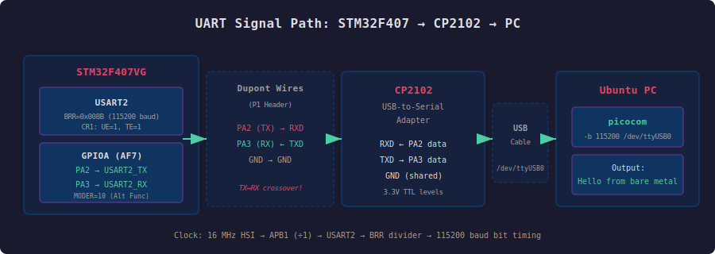
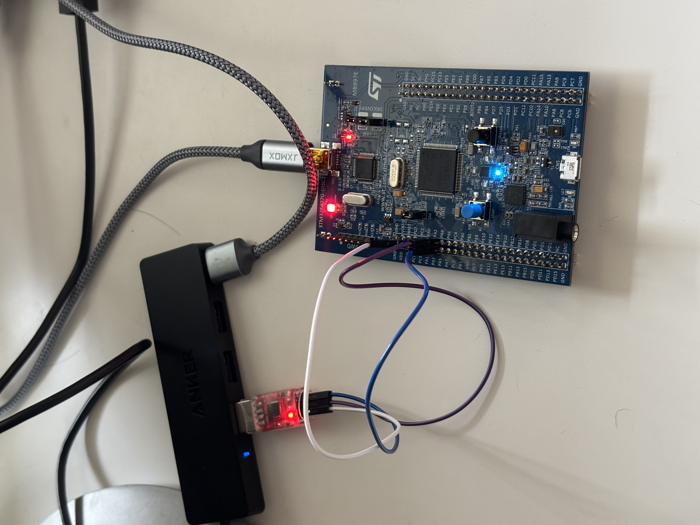
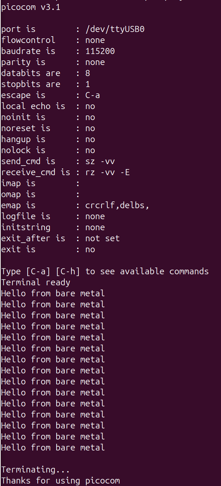

# Project 1.2: Bare-Metal UART on STM32F407 Discovery Board

Direct register-level UART configuration on the STM32F407VG — no HAL, no libraries, no CubeIDE. Every register write is derived from the reference manual and datasheet.

## What This Project Does

Configures USART2 on the STM32F407 Discovery Board (MB997E) to transmit serial data at 115200 baud over a CP2102 USB-to-serial adapter. The main loop toggles an LED and prints `"Hello from bare metal\r\n"` to a terminal on the host PC, providing both visual and serial confirmation that the firmware is running.

## Signal Path



```
STM32F407VG          Dupont Wires        CP2102           USB        Ubuntu PC
┌──────────┐        ┌───────────┐      ┌─────────┐      Cable     ┌──────────┐
│ USART2   │        │           │      │ USB-to- │    ┌───────┐  │ picocom  │
│  PA2(TX)─┼──────► │ TX → RXD ─┼─────►│ Serial  ├────┤  USB  ├──►-b 115200 │
│  PA3(RX)─┼◄────── │ RX ← TXD ─┼◄────┤ Adapter │    └───────┘  │/dev/     │
│  GND ────┼────────│ GND ──────┼──────┤ GND     │               │ ttyUSB0  │
└──────────┘        └───────────┘      └─────────┘               └──────────┘
```

**Key detail:** TX connects to RXD, RX connects to TXD. The crossover is intentional — one side's transmit is the other side's receive.

## Hardware Setup

### Board
- **STM32F407G-DISC1** (MB997E revision)
- Running on default 16 MHz HSI (High-Speed Internal) oscillator
- No PLL configuration — all buses at 16 MHz

### Serial Adapter
- **CP2102 USB-to-TTL module** (HW-598A)
- Connected via 3 female-to-female dupont wires to P1 header

### Why CP2102 Instead of ST-LINK VCP?

The Discovery board's ST-LINK/V2-A supports a Virtual COM Port (VCP), but the VCP pins (U2 pin 12 and 13) are **not connected** to the STM32F407's USART pins by default. Section 7.2.3 of UM1472 documents this limitation and suggests either flying wires to the IC pins or using an external USB-to-serial adapter.

The IC pins on the ST-LINK chip (STM32F103, LQFP package) are 0.5mm pitch surface-mount leads — not practical for dupont connectors. A CP2102 adapter provides a clean connection directly to the P1 header pins with no soldering required.

**Nucleo boards don't have this problem** — they route VCP to the target MCU's USART automatically.

### Wiring

| Discovery Board (P1) | CP2102 Module | Wire Color |
|----------------------|---------------|------------|
| PA2 (pin 14)         | RXD           | Purple     |
| PA3 (pin 13)         | TXD           | Blue       |
| GND (pin 1)          | GND           | White      |



## Register-Level Configuration

### 1. Clock Enables (RCC)

Three clocks must be enabled before configuring any peripheral:

| Register | Bit | Peripheral | Bus |
|----------|-----|-----------|-----|
| RCC_AHB1ENR (0x40023830) | Bit 0 | GPIOA | AHB1 |
| RCC_AHB1ENR (0x40023830) | Bit 3 | GPIOD (LED) | AHB1 |
| RCC_APB1ENR (0x40023840) | Bit 17 | USART2 | APB1 |

**Why different buses?** GPIO requires fast access (AHB1, up to 168 MHz). USART2 runs at low speeds and sits on APB1 (max 42 MHz) to save power. At default HSI settings, all buses run at 16 MHz.

### 2. GPIO Alternate Function (GPIOA)

PA2 must be switched from its default GPIO mode to USART2_TX via alternate function mapping:

**GPIOA_MODER** (0x40020000): Set bits [5:4] to `10` (alternate function mode)
- Each pin gets 2 bits: `00`=input, `01`=output, `10`=alt function, `11`=analog
- PA2 position: pin × 2 = bit 4

**GPIOA_AFRL** (0x40020020): Set bits [11:8] to `0x7` (AF7 = USART2)
- Each pin gets 4 bits in the alternate function register
- PA2 position: pin × 4 = bit 8
- AF7 mapping found in DS8626 Table 9 (Alternate Function Mapping)

### 3. Baud Rate (USART2_BRR)

**Formula:** `USARTDIV = f_clk / (16 × baud_rate)`

```
f_clk   = 16,000,000 Hz  (HSI, APB1 prescaler = 1)
baud    = 115,200
USARTDIV = 16,000,000 / (16 × 115,200) = 8.6805...

Mantissa = 8       → bits [15:4]
Fraction = 0.6805 × 16 = 10.888 ≈ 11 (0xB) → bits [3:0]

BRR = (8 << 4) | 0xB = 0x008B
```

### 4. USART Enable (USART2_CR1)

| Bit | Name | Value | Purpose |
|-----|------|-------|---------|
| 13  | UE   | 1     | USART Enable |
| 3   | TE   | 1     | Transmitter Enable |

BRR must be set **before** enabling UE and TE.

### 5. Transmit Functions

`uart2_write_byte`: Polls TXE flag (bit 7 in USART_SR) until the transmit data register is empty, then writes one byte to USART_DR.

`uart2_write_string`: Iterates through a null-terminated string, calling `uart2_write_byte` for each character.

**Two-stage pipeline:** Writing to DR transfers the byte to an internal shift register that clocks bits out on the wire. DR is immediately free for the next byte — you don't wait for full transmission, only for DR to empty.

## Documentation References

| Document | Section | What I Used It For |
|----------|---------|-------------------|
| **RM0090** (Reference Manual) | §2.3 Memory Map | Base addresses: RCC, GPIOA, GPIOD, USART2 |
| **RM0090** | §7 RCC | Clock enable registers (AHB1ENR, APB1ENR), HSI default |
| **RM0090** | §8 GPIO | MODER and AFRL register layouts |
| **RM0090** | §30 USART | BRR, CR1, SR, DR registers and baud rate formula |
| **DS8626** (Datasheet) | Table 9 | PA2 → AF7 → USART2_TX pin mapping |
| **UM1472** (Board Manual) | §7.2.3 | VCP not connected; CP2102 alternative documented |
| **UM1472** | Table 7 | PA2/PA3 not used by other board peripherals |

## Build and Flash

```bash
make          # Compile
make flash    # Flash via OpenOCD + ST-LINK
picocom -b 115200 /dev/ttyUSB0   # Open serial terminal
```

To exit picocom: `Ctrl-A` then `Ctrl-X`.

## Terminal Output

```
Hello from bare metal
Hello from bare metal
Hello from bare metal
...
```



## What I Learned

- **Board manual vs chip manual:** The datasheet and reference manual describe the chip. The user manual describes the board — wiring, connectors, and what's actually connected. Choosing a USART is a board-level decision, not a chip-level one.
- **VCP is not automatic:** I initially assumed USART2 routed through the ST-LINK debugger to my PC. UM1472 §7.2.3 clarified that the VCP pins aren't connected to the STM32F407 on the Discovery board. This led to using a CP2102 adapter instead.
- **Pin muxing:** A single physical pin can serve many peripherals. The AFRL register selects which one. This is why you check the alternate function mapping table before choosing pins.
- **Baud rate is a mutual agreement:** Both sides must be configured identically. The BRR register encodes a fixed-point clock divider — getting it wrong produces garbage in the terminal.
- **Bus architecture matters for clock config:** GPIOA clock is on AHB1, USART2 clock is on APB1. Different enable registers for different buses. The bus speed also affects the baud rate calculation. The differing clock speeds on the different buses can be intrepeted like a highway system: AHB1 (fastest) is the interstate, APB2 (faster) is state highway, APB1 (slow) is a country road.
- **The peripheral setup pattern repeats:** Enable clock → configure GPIO → configure peripheral → use it. This is the same sequence for I2C, SPI, timers, and every other peripheral.

## Project Structure

```
project-1.2-uart/
├── src/
│   └── main.c
├── include/
├── startup/
│   └── startup_stm32f407.s
├── linker/
│   └── stm32f407.ld
├── Makefile
├── images/
│   ├── uart_signal_path.svg
│   ├── uart_wiring.jpg
│   └── terminal_output.png
└── README.md
```

## Previous Project

- [Project 1.1: Bare-Metal LED Toggle](../project-1.1-led/README.md) — Direct register manipulation for GPIO output
